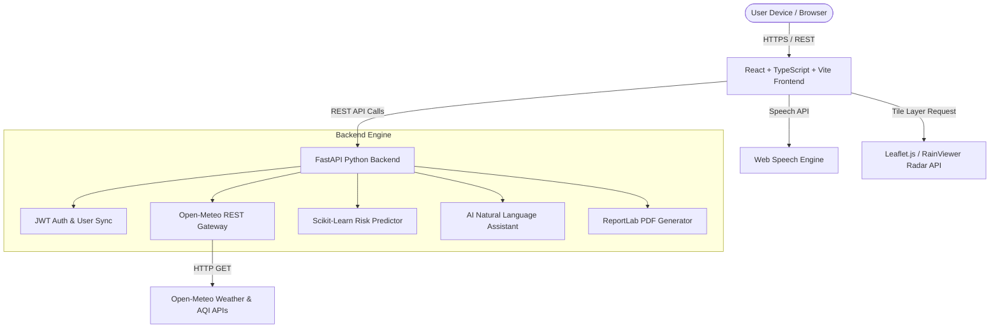
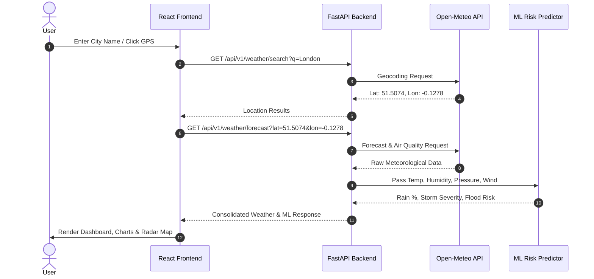

# System Architecture & UML Specification
## Advanced AI-Powered Weather Forecasting Application

---

### 1. High-Level Architecture Diagram (Mermaid)

---

### 2. Sequence Diagram: Weather Search & ML Risk Computation

---

### 3. Component Architecture Breakdown
- **Frontend Layer**:
  - `Navbar.tsx`: Search auto-suggest, GPS trigger, theme/unit toggles.
  - `CurrentWeatherCard.tsx`: Hero dashboard display with animated background styling.
  - `ForecastCharts.tsx`: Chart.js interactive hourly graphs.
  - `InteractiveMap.tsx`: Leaflet tile layers with live rain radar.
  - `AIAssistant.tsx`: Chat window with voice recognition & synthesis.
  - `MLRiskPredictor.tsx`: Scikit-learn risk cards.
  - `AirQualityModule.tsx`: Pollutant gauge meters.
- **Backend Services**:
  - `weather_service.py`: Async HTTP gateway for Open-Meteo APIs with WMO code translation.
  - `ml_service.py`: Scikit-Learn RandomForest classifier and regressor models.
  - `ai_assistant_service.py`: Rule-assisted conversational engine.
  - `pdf_service.py`: ReportLab PDF document builder.
