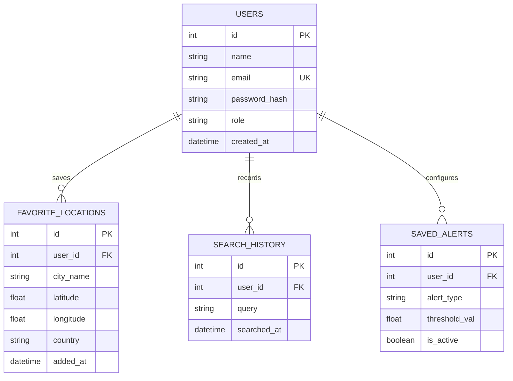

# Database Schema & Entity-Relationship Diagram (ERD)
## Advanced AI-Powered Weather Forecasting Application

---

### 1. Entity-Relationship Diagram (Mermaid)



---

### 2. Relational SQL Schema Definitions

```sql
-- Users Table
CREATE TABLE users (
    id SERIAL PRIMARY KEY,
    name VARCHAR(100) NOT NULL,
    email VARCHAR(255) UNIQUE NOT NULL,
    password_hash VARCHAR(255) NOT NULL,
    role VARCHAR(20) DEFAULT 'user',
    created_at TIMESTAMP WITH TIME ZONE DEFAULT CURRENT_TIMESTAMP
);

-- Favorite Locations Table
CREATE TABLE favorite_locations (
    id SERIAL PRIMARY KEY,
    user_id INT REFERENCES users(id) ON DELETE CASCADE,
    city_name VARCHAR(150) NOT NULL,
    latitude DOUBLE PRECISION NOT NULL,
    longitude DOUBLE PRECISION NOT NULL,
    country VARCHAR(100),
    added_at TIMESTAMP WITH TIME ZONE DEFAULT CURRENT_TIMESTAMP
);

-- Search History Table
CREATE TABLE search_history (
    id SERIAL PRIMARY KEY,
    user_id INT REFERENCES users(id) ON DELETE CASCADE,
    query VARCHAR(255) NOT NULL,
    searched_at TIMESTAMP WITH TIME ZONE DEFAULT CURRENT_TIMESTAMP
);

-- Saved Alert Preferences Table
CREATE TABLE saved_alerts (
    id SERIAL PRIMARY KEY,
    user_id INT REFERENCES users(id) ON DELETE CASCADE,
    alert_type VARCHAR(50) NOT NULL, -- 'Rain', 'Heatwave', 'Storm', 'AQI'
    threshold_val DOUBLE PRECISION,
    is_active BOOLEAN DEFAULT TRUE
);
```
